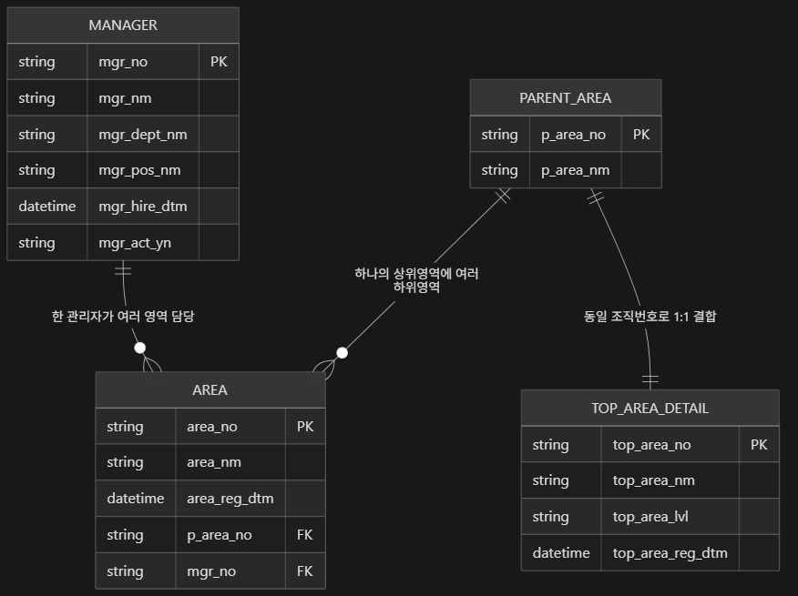
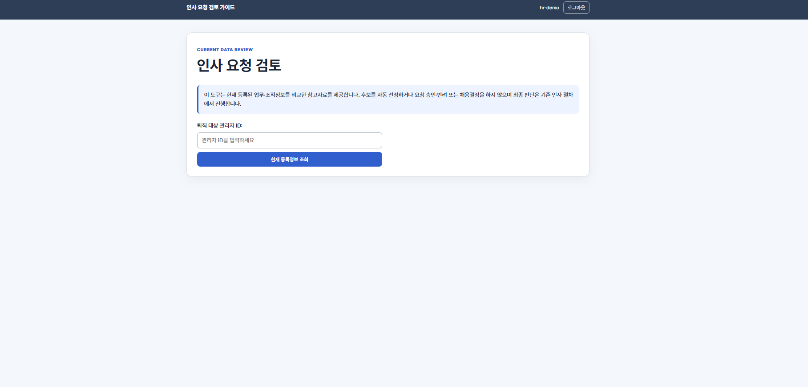
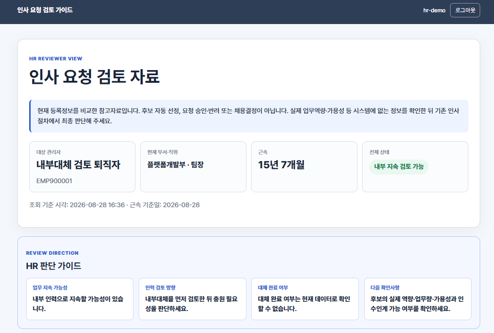
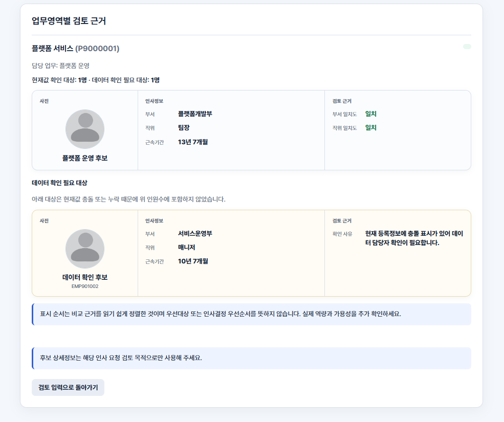

# MLO 1기 2차 프로젝트

## 1. 팀 소개

### 팀명

- 팀명: `mlo-01-p2-team2`

### 멤버

| 이름 | 역할 | GitHub |
|---|---|---|
| 강한솔 | 팀장 | [hansolsmart](https://github.com/hansolsmart) |
| 김건우 | 팀원 | [natural0448](https://github.com/natural0448) |
| 김세진 | 팀원 | [BSSM17](https://github.com/BSSM17) |
| 이여찬 | 팀원 | [Ducks-Lee](https://github.com/Ducks-Lee) |

## 2. 프로젝트 개요

### 프로젝트 명

- 퇴직 관리자 발생 시 대체인력 후보 추천 시스템

### 프로젝트 기간

- 2026년 8월 27일(목) ~ 8월 28일(금)

### 프로젝트 소개

- 퇴직 관리자가 담당하던 업무영역과 후보 관리자의 부서, 직위, 근속 정보를 활용하여 대체인력 후보를 검토할 수 있도록 지원하는 시스템이다.
- 통합 레거시 원천을 Bronze에 보존하고 Silver 데이터로 표준화한 뒤, 규칙 기반 후보 정렬과 Django 내부 검토 화면까지 연결한다.

### 프로젝트 필요성(배경)

- 기존 인사·조직 데이터에는 식별자, 재직 상태, 조직 레벨, 날짜 형식이 일관되지 않아 관리자와 업무영역을 안정적으로 연결하기 어렵다.
- 원천 데이터의 계보와 복원 여부를 추적할 수 없으면 추천 후보의 선정 근거와 데이터 품질을 검증하기 어렵다.
- 원본을 변경 없이 보존하고 표준 데이터로 정규화하여, 대체인력 검토 과정의 신뢰성과 재현성을 확보하고자 한다.

### 프로젝트 목표

1. Bronze CSV의 고유 `source.record_id`를 기준으로 RAW_DB 복원율 95% 이상 달성
2. Bronze 원본·계보·SHA-256 보존 무결성 100% 달성
3. 직원, 업무영역, 상위영역 데이터의 컬럼명·타입·코드·날짜 형식 표준화
4. PK·FK·필수값·도메인·날짜 품질 검증과 오류 데이터 격리
5. 대체인력 후보 검토에 활용할 수 있는 Silver·Gold 데이터 기반 구축
6. Gold 계층의 규칙 기반 후보 정렬 및 Django 내부 검토 화면 구현

### Gold 대체인력 후보 추천·검토 MVP

Gold 후보 검토 결과를 제공하는 Django 내부 검토 화면을 구현했다.

후보별 부서·직위·근속기간과 주요 검토 근거를 확인할 수 있으며, 부서 일치·직위 일치·근속기간·이름·직원 ID 순으로 정렬된 후보 목록을 제공한다. 숫자 후보 점수나 자동 선정은 제공하지 않으며, 최종 인사 결정은 담당자가 수행한다.

- 내부 지속 검토 가능
- 일부 영역 내부 지속 검토 가능
- 내부 인력 근거 미확인
- 데이터 확인 전 판단 불가

전체 사업 규칙, 아키텍처, 파일별 역할, 실행 방법, 테스트 및 운영 전 차단사항은 [내부 인사 요청 검토 가이드 통합 구현 설명서](django/INTERNAL_HR_GUIDE_IMPLEMENTATION_GUIDE.md)를 기준으로 확인한다. 후속 개발자는 [인수인계 색인](django/HANDOFF_INDEX.md)에서 구현 파일 바로 옆에 배치된 개별 `*.HANDOFF.md`를 확인한다.

### 프로젝트 서비스 구현 기획

- `구글스프레드시트 링크` [인사데이터 정규화 서비스기획서](https://docs.google.com/spreadsheets/d/15OUUMSdnTXu12Z6qTOjmjGzySrY0geqHWaeLDEIrNHA/edit?gid=589290982#gid=589290982)

## 3. 기술 스택

| 구분 | 기술 |
|---|---|
| Language | Python |
| Data | MongoDB, MySQL |
| Data Format | CSV, JSON, YAML |
| Collaboration | GitHub, Google Sheets |
| Documentation | Markdown, Mermaid |

## 4. WBS 및 요구사항 명세서

| 담당자 | 역할·담당영역 | 작업내용 |
|---|---|---|
| 강한솔 | pa | 프로젝트 초기 설계, 요구사항 및 문서 관리, 작업 환경·공통 기준 수립, 팀원 역할 및 업무 분배 |
| 김건우 | pm, 골드티어 | 화면MVP 및 상세구현, 시연자료연계 |
| 김세진 | 표준화·품질검증, 실버티어 | 컬럼명·코드·날짜·빈값 표준화 및 품질 검증 |
| 이여찬 | 크롤링·DB적재, 브론즈티어 | 원천 데이터 크롤링 및 DB 적재 |
| 전원 | 요구사항 검토 | 작업 범위와 결과물 확인, 팀 의견 반영 |

---

## 5. ERD



- 직원, 업무영역, 상위 업무영역 간 관계 확인
- 업무영역별 담당 관리자 연결
- 퇴직 관리자 담당 업무와 관련 인력 조회를 위한 구조 확인

[Silver ERD 상세 문서](docs/TO_BE_MEDALLION_MODEL.md)

---

## 6. 주요 프로시저

| 순서 | 주요 파일 또는 절차 | 작업내용 |
|---|---|---|
| 1 | `validation_pipeline/src/mongo_pipeline/sources.py` | YAML·CSV·JSONL·MongoDB 자료 수집 |
| 2 | `validation_pipeline/src/mongo_pipeline/bronze.py` | 원본 자료, 행 번호, SHA-256 확인값, 실행 정보 보관 |
| 3 | `validation_pipeline/src/mongo_pipeline/rule_standardizer.py` | YAML 기준에 따른 컬럼명·코드·날짜·NULL 표준화 |
| 4 | `validation_pipeline/src/mongo_pipeline/validators.py` | 필수값·자료형·중복 등 기본 검증 |
| 5 | `validation_pipeline/src/mongo_pipeline/silver.py` | Silver 모델 분리, 관계·도메인 검증 |
| 6 | `validation_pipeline/src/mongo_pipeline/pipeline.py` | 표준화·검증 실행, 정상 자료와 오류 자료 분리 |
| 7 | `validation_pipeline/src/mongo_pipeline/sinks.py` | Bronze·Silver·오류 자료·Manifest·처리 결과 저장 |
| 8 | `django/second_project/management/commands/load_success_to_sqlite.py` 및 `django/second_project/services/success_to_sqlite.py` | 성공 Silver 자료의 SQLite 저장 |
| 9 | `validation_pipeline/src/mongo_pipeline/loggers.py` | 표준화·검증·격리·복원 결과 기록 |
| 10 | `validation_pipeline/src/gold_pipeline/pipeline.py` | Silver 성공 데이터를 Gold AI Ready 데이터셋과 검증·배포 패키지로 생성 |
| 11 | `django/second_project/services/continuity_assessment.py` | 품질·재직 조건 적용, 규칙 기반 후보 정렬 및 내부 검토 결과 생성 |

처리 순서:

```text
자료 수집
→ 원본 보관
→ 자료 기준 통일
→ 품질 검증
→ 정상·오류 자료 분리
→ 정리 결과 저장
→ 처리 결과 기록
→ Gold 데이터 패키지 생성
→ 규칙 기반 후보 검토 화면 제공
```

---

## 7. 수행결과(테스트/시연 페이지)

### 테스트

- 전체 테스트 실행 명령

```powershell
$env:PYTHONPATH = "src"
python -m unittest discover -s tests -v
```

- 입력 자료 수와 정상·오류 자료 수 비교
- 처음 받은 자료와 정리 결과 연결 여부 확인
- 필수값·중복·연결 관계·상태·날짜 오류 확인
- SQLite 저장 전 검증만 수행하는 `dry-run` 확인

### 시연 결과

- 정리 결과 위치: `validation_pipeline/output/<run-id>/`
- 정상 자료 및 오류 자료 확인
- 업무영역별 담당자 정보 조회
- 퇴직 관리자 담당 업무와 관련 인력 확인





---

## 8. 한 줄 회고

| 담당자 | 한 줄 회고 |
|---|---|
| 강한솔 | 프로젝트 초기 세팅과 설계 단계에서 사전 검토와 준비, 고려해야 할 요소가 많다는 점을 알게 되었다. |
| 김건우 | 프로젝트 기간동안 다소 급박하게 진행되어서, 실제 해야 하는 부분을 놓친 것이 많아 다소 아쉬웠다. 실제 서비스를 제공하기 위해선 인터페이스에 대한 많은 고민을 하고 사용자 편의성 고려를 더 많이 해야 할 것같다. |
| 김세진 | 통합을 위해 병합하는 작업이 얼마나 어려운지 알 수 있었으며, AI를 활용해서 협업하는 과정과 서비스를 제작하고 운영을 하는게 얼마나 어려운 일인지 알 수 있었습니다. |
| 이여찬 | 파이프라인을 구현하며, 데이터의 원본을 남겨두는 것이 이후의 검증과 개선을 가능하게 한다는 점을 체감했다. |


