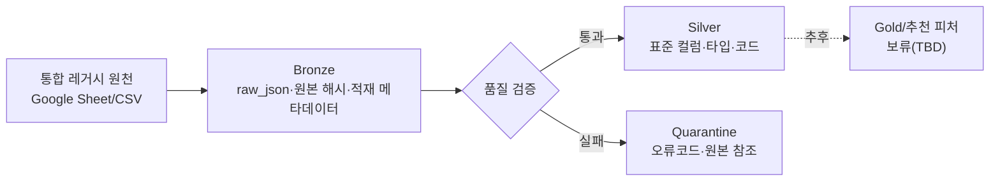

# 퇴직 관리자 대체인력 후보 추천 데이터 기반 구축

- 팀명: `mlo-01-p2-team2`
- 프로젝트 기간: 2026-08-27(목) ~ 2026-08-28(금)
- 현재 단계: RAW_DB 복원 및 Bronze/Silver 표준화
- Gold 계층 및 추천 피처 구조: 보류(TBD)

## 1. 프로젝트 목적

퇴직 관리자 발생 시 업무영역, 부서, 직위, 근속 정보를 활용해 대체인력 후보를 추천할 수 있도록 원천 인사·조직 데이터를 추적 가능하게 보존하고 표준화한다. 이번 단계의 완료 범위는 추천 모델 구현이 아니라, 추천 시스템이 사용할 수 있는 신뢰 가능한 Bronze/Silver 데이터 기반 구축이다.

## 2. 핵심 목표

| 목표 | 기준 |
|---|---|
| RAW_DB 복원율 | Bronze의 고유 `source.record_id` 대비 95% 이상 |
| Bronze 원본 보존 무결성 | 100% |
| Silver PK 중복 | 0건 |
| 승인되지 않은 필수값 누락 | 0건 |
| FK 고아 레코드 | 0건 |
| 승인되지 않은 코드 도메인 위반 | 0건 |

RAW_DB 복원율 산식:

```text
정규화 결과까지 정상 연결된 고유 source.record_id 수
÷ Bronze CSV의 고유 source.record_id 수
× 100
```

## 3. 데이터 흐름



## 4. 문서 구성

| 파일 | 역할 |
|---|---|
| `AS_IS_PROFILING.md` | 현재 원천·Bronze·정규화 결과 분석 |
| `DATA_STANDARD_DICTIONARY.md` | 표준 컬럼, 타입, 도메인, 변환 규칙 |
| `TO_BE_MEDALLION_MODEL.md` | Bronze/Silver 구조, ERD, 품질 흐름 |
| `LOGGING_RULES.md` | 실행·복원·검증 로그 규칙 |
| `DECISION_LOG.md` | 확정 사항과 미결 결정 기록 |
| `validation-rules.yaml` | 기계 판독 가능한 품질 규칙 |
| `manifest-schema.json` | Bronze manifest 스키마 |
| `RETROSPECTIVE.md` | 프로젝트 회고 양식 |

`RAW_DATA_FORMAT.md`, `INTERFACE_SPEC.md`, `STANDARD_COLUMNS.md`의 역할은 각각 `TO_BE_MEDALLION_MODEL.md`와 `DATA_STANDARD_DICTIONARY.md`로 통합한다.

## 5. 실행 순서

1. 원천을 수정하지 않고 Bronze에 적재한다.
2. manifest에 `run_id`, 원본 위치, 수집시각, 건수, 크기, SHA-256을 기록한다.
3. `validation-rules.yaml`로 Bronze 무결성과 Silver 품질을 검증한다.
4. 통과 데이터는 Silver로, 실패 데이터는 Quarantine으로 분리한다.
5. Bronze 고유 `source.record_id`와 Silver 결과를 대조해 RAW_DB 복원율을 계산한다.
6. 실행 결과를 JSON Lines 로그로 저장한다.

## 6. 완료 증적

- Bronze manifest
- 단계별 JSON Lines 로그
- 품질 검증 결과와 Quarantine 목록
- RAW_DB 복원율 계산 결과
- Silver 테이블별 행 수·PK/FK 검증 결과

## 7. 참고 자료

- 2차 프로젝트 공식 가이드: <https://praxolve.net/encore/mlops2026/chapters/chapter-2/days/day-06/supplements/f34b3c6f-450c-4804-9a3a-f2e735eb04bf>
- 통합 레거시 원천 시트: <https://docs.google.com/spreadsheets/d/16CT6Zj_YBLnlA6oOhOUVetPUlf4f6OtoEHyfd7NKsuc/edit?gid=0#gid=0>
- 서비스기획서 수정 대상: <https://docs.google.com/spreadsheets/d/15OUUMSdnTXu12Z6qTOjmjGzySrY0geqHWaeLDEIrNHA/edit?gid=589290982#gid=589290982>

