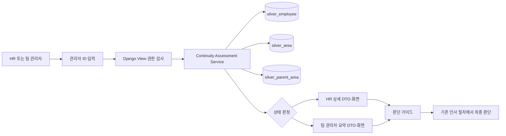

# 내부 인사 요청 검토 가이드 통합 구현 설명서

- 문서 기준일: `2026-08-28`
- 대상 브랜치: `gold-implement`
- 기준 커밋: `8c18d87`
- 제품 성격: 사내 HR·팀 관리자용 인사 요청 검토 보조 도구
- 구현 방식: Django 서버 렌더링 화면 + 현재 RDB 조회 모델
- 운영 상태: 개발·데모 가능, 실데이터 Gate 1 및 운영배포 미승인

## 1. 문서 목적

이 문서는 현재까지 기획하고 구현한 내부 인사 요청 검토 가이드의 전체 구조를 설명한다. 새 담당자가 다음 내용을 하나의 문서에서 파악할 수 있도록 구성했다.

- 이 도구가 해결하려는 업무 문제
- 현재 ERD와 Django 구현의 연결 관계
- 내부 지속 가능성과 충원 검토 방향을 산출하는 규칙
- HR과 팀 관리자의 권한 차이
- 생성·변경된 파일의 역할
- 로컬 실행, 테스트, migration 및 데이터 준비도 확인 방법
- 현재 구현의 한계와 운영 전 필수 결정사항

## 2. 사업 목적과 범위

### 2.1 해결하려는 문제

관리자 퇴직 또는 비활성화가 발생했을 때 HR 담당자는 다음 질문에 빠르게 답할 근거가 필요하다.

1. 퇴직 대상 관리자가 어떤 업무영역을 담당했는가?
2. 같은 업무영역을 담당하는 재직 관리자가 존재하는가?
3. 내부 인력으로 업무를 지속할 가능성이 있는가?
4. 내부대체를 먼저 검토할지, 이동·분담·채용을 포함한 충원 검토로 넘어갈지?
5. 현재 데이터가 부족하거나 충돌하여 판단을 보류해야 하는가?

이 도구는 위 질문에 필요한 현재값 근거를 제공한다. 최종 인사발령, 요청 승인·반려 또는 채용 여부를 자동으로 결정하지 않는다.

### 2.2 BRD와 후속 승인 관계

`docs/brd.md` v1.2는 데이터 정비와 후보 검토 자료 준비를 중심으로 하며 화면 구현과 자동 추천을 제외한다. 이후 사용자와의 기획 협의 및 `2026-08-27` Gate 0 승인으로 다음 범위가 추가 승인됐다.

- Django 내부 조회 화면
- HR 상세 화면과 팀 관리자 요약 화면
- 네 가지 상태와 중립적인 검토 방향 안내
- 결과를 저장하지 않는 화면 전용 조회

자동 추천·최종 결정·결과 저장은 여전히 제외 범위다.

### 2.3 구현 범위

- Django 인증과 Group 기반 역할 분리
- 퇴직 대상 관리자 ID 입력
- 담당 AREA 및 PARENT_AREA 조회
- 같은 PARENT_AREA의 재직 관리자 조회
- 부서·직위·근속 비교 근거 표시
- 데이터 누락·충돌 보류 처리
- HR 상세 결과와 팀 관리자 비식별 요약
- 기술적 데이터 준비도 점검 명령
- migration graph 병합과 DB Router
- 단위·통합·권한·migration 회귀 테스트

### 2.4 제외 범위

- 숫자 후보 점수 산정과 최종 인사 대상 자동선정
- 유사 직위 자동 매핑
- 요청 자동 승인·반려
- 신규채용 필요·불필요 자동 확정
- 후보의 실제 역량·업무량·가용성 판단
- 인수인계 완료 여부 판단
- 결과·의사결정·인사요청 이력 테이블 추가
- PDF·CSV·Excel 내보내기
- 기존 인사시스템 자동연계
- 물리적 반정규화 테이블

## 3. 핵심 설계 원칙

1. 현재 RDB의 정규화 테이블을 정본으로 사용한다.
2. 물리적 반정규화 대신 Django 서비스가 화면용 읽기 모델을 조합한다.
3. 업무영역 연결은 이름이 아니라 `parent_area_id`, 즉 기존 ERD의 `p_area_no`로 수행한다.
4. 후보는 `is_active=True`인 재직 관리자만 포함한다.
5. 퇴직 대상자 본인은 후보에서 제외한다.
6. 부서·직위·근속은 탈락점수가 아니라 비교 근거와 안정적인 표시 순서에 사용한다.
7. 후보 없음과 데이터 부족을 다른 상태로 표현한다.
8. 후보 존재를 대체 완료나 채용 불필요로 해석하지 않는다.
9. 후보 부재를 채용 확정으로 해석하지 않는다.
10. HR과 팀 관리자에게 전달하는 데이터 객체 자체를 분리한다.

## 4. 전체 구조



웹 화면은 별도의 후보 결과 테이블을 생성하지 않는다. 매 요청마다 현재 RDB를 읽어 결과를 계산한다.

## 5. 현재 RDB 구조와 사용 방식

| ERD 엔터티 | Django 모델 | 주요 필드 | 이번 기능에서의 역할 |
|---|---|---|---|
| `MANAGER` | `SilverEmployee` | `employee_id`, `employee_name`, `profile_image_url`, `department_name`, `position_name`, `hire_datetime`, `is_active` | 퇴직 대상 및 재직 후보 현재값. 사진 URL은 선택값이며 기존 행은 `NULL` |
| `AREA` | `SilverArea` | `area_id`, `area_name`, `manager_employee_id`, `parent_area_id` | 관리자 담당 업무 및 관계 연결 |
| `PARENT_AREA` | `SilverParentArea` | `parent_area_id`, `parent_area_name` | 동일 업무영역군 판정 키 |
| `TOP_AREA_DETAIL` | `SilverTopAreaDetail` | `top_area_id`, `top_area_name`, `top_area_level` | RDB 정본에는 유지하지만 현재 후보 조회에는 사용하지 않음 |
| 레거시 스테이징 | `LegacyOrgRecord` | 원본 관리자·업무영역 필드 | 적재 및 계보 확인용이며 화면 판정 정본이 아님 |

관계는 다음과 같다.

- `SilverEmployee 1 : N SilverArea`
- `SilverParentArea 1 : N SilverArea`
- 후보 연결 기준은 같은 `SilverArea.parent_area_id`

`parent_area_name`은 화면 표시용이다. 이름이 같더라도 ID가 다르면 같은 업무영역으로 자동 합치지 않는다.

## 6. 조회 및 판정 규칙

### 6.1 대상 관리자 조건

- 관리자 ID 형식: `EMP` + 숫자 6자리
- RDB에 존재하지 않으면 `TARGET_NOT_FOUND`
- `is_active=True`이면 퇴직 대상 분석을 거부하고 `TARGET_IS_ACTIVE`
- 이름·부서·직위가 비어 있거나 `DATE_CONFLICT`가 있으면 전체 `ON_HOLD`
- 담당 AREA가 없으면 전체 `ON_HOLD`

현재 구현은 `is_active=False`를 조회 진입 조건으로 사용하지만, BRD가 지적한 것처럼 비활성이 실제 퇴직과 항상 같다는 업무 승인은 별도로 필요하다.

### 6.2 후보 조건

후보는 다음 조건을 모두 만족해야 한다.

1. `is_active=True`
2. 대상자의 AREA와 같은 `parent_area_id`를 담당
3. 대상자 본인이 아님
4. 같은 Parent 안에서 관리자 ID 기준 중복 제거

후보의 이름·부서·직위가 비어 있거나 `DATE_CONFLICT`가 있으면 확정 가능한 후보 수에서 제외하고 HR 전용 `데이터 확인 필요 대상`으로 분리한다.

### 6.3 비교 근거와 표시 순서

후보는 다음 순서로 화면에 안정적으로 표시된다.

1. 대상자와 부서가 같은 후보
2. 대상자와 직위가 같은 후보
3. 근속기간이 긴 후보
4. 이름과 관리자 ID

이 순서는 부서·직위·근속기간을 일관되게 보여주기 위한 규칙 기반 표시 순서다. 숫자 추천점수나 최종 인사 우선순위가 아니며, HR 화면에도 자동 선정을 뜻하지 않는다는 안내가 표시된다.

### 6.4 근속기간

- 조회일을 기준으로 연·월 단위로 계산한다.
- 입사일이 조회 기준일 이후이면 `산정 불가` 경고를 표시한다.
- 현재 정책에서는 미래 입사일 후보를 자동 제외하지 않는다.
- 미래 입사일을 전체 보류로 전환할지는 데이터오너 결정사항이다.

## 7. 상태와 판단 가이드

| 내부 상태 | 화면 표시 | 의미 | 인력 검토 방향 |
|---|---|---|---|
| `REVIEWABLE` | 내부 지속 검토 가능 | 모든 등록 업무영역에 현재값 확인 대상이 있음 | 내부대체를 먼저 검토한 뒤 충원 필요성 판단 |
| `PARTIAL` | 일부 영역 내부 지속 검토 가능 | 업무영역별 결과가 혼합됨 | 내부대체와 부족 영역의 이동·분담·채용을 함께 검토 |
| `NO_MATCH` | 내부 인력 근거 미확인 | 현재 데이터에서 확인 가능한 재직 후보가 없음 | 업무 누락 확인 후 전환배치·분담·채용 검토 |
| `ON_HOLD` | 판단 보류 · 데이터 정정 필요 | 관계 누락, 프로필 누락 또는 충돌 때문에 확정 불가 | 내부 대체·신규채용 판단을 모두 보류하고 데이터 정정 후 재조회 |

각 결과 화면은 다음 네 항목을 별도 카드로 보여준다.

- 업무 지속 가능성
- 인력 검토 방향
- 대체 완료 여부
- 다음 확인사항

`REVIEWABLE`이어도 대체 완료를 의미하지 않는다. 시스템에는 후보자의 실제 업무량, 역량, 배치 의사, 인수인계 완료 정보가 없기 때문이다.

## 8. 역할과 개인정보 노출

| 항목 | HR `hr_reviewer` | 팀 관리자 `team_manager` | 기타 계정 |
|---|---:|---:|---:|
| 검토 화면 접근 | 가능 | 가능 | 403 |
| 대상 관리자 이름 | 표시 | 표시 | 미표시 |
| 대상 관리자 부서·직위·근속 | 표시 | 미표시 | 미표시 |
| 후보 이름·ID | 표시 | 미표시 | 미표시 |
| 후보 부서·직위·근속 | 표시 | 미표시 | 미표시 |
| 후보별 데이터 경고 | 표시 | 미표시 | 미표시 |
| 업무영역별 후보 수 | 표시 | 표시 | 미표시 |
| 최종 인사결정 | 기존 절차에서 수행 | 기존 절차에서 협의 | 불가 |

팀 관리자 화면은 `AssessmentSummary` DTO만 전달받는다. 전체 `ContinuityAssessment` 객체를 템플릿에 전달한 뒤 숨기는 방식이 아니므로 후보 개인정보가 HTML에 섞이는 것을 방지한다.

현재 남은 보안 과제는 팀 관리자가 입력한 대상이 실제 자기 팀의 승인된 인사요청인지 확인하는 소유권 연결이다. 현재 ERD에는 Django 사용자와 조직·인사요청의 관계가 없으므로 기존 인사시스템 요청 ID 또는 SSO 조직 claim이 필요하다.

## 9. 웹 요청 흐름

1. 사용자가 `/login/`에서 인증한다.
2. 루트 URL은 `/second_project/review/`로 이동한다.
3. `hr_reviewer` 또는 `team_manager`만 입력 화면에 접근한다.
4. 관리자는 `EMP000000` 형식의 대상 ID를 POST한다.
5. 결과는 같은 URL에서 렌더링된다.
6. 관리자 ID를 URL path 또는 query string에 남기지 않는다.
7. 응답에는 `Cache-Control: no-store, private`와 `Referrer-Policy: no-referrer`를 적용한다.
8. 결과는 DB에 저장하지 않는다.

Codex 내장 브라우저는 로컬 폼 전송 시 `Origin: null`을 사용할 수 있다. `LocalNullOriginMiddleware`는 `DEBUG=True`이며 호스트가 `127.0.0.1`, `localhost`, `[::1]`인 경우에만 이를 허용한다. 운영 `DEBUG=False`에서는 원래 Django CSRF 검사가 그대로 적용된다.

## 10. 생성·변경 파일 설명

### 10.1 Django 프로젝트 설정

| 파일 | 역할 |
|---|---|
| `django/config/settings.py` | 환경변수 기반 Secret·DEBUG·Hosts·DB·Timezone·보안 쿠키·HSTS·로그인 경로 설정 |
| `django/config/urls.py` | 로그인·로그아웃·Admin·검토 앱 URL 및 루트 리다이렉트 구성 |
| `django/config/database_router.py` | Bronze 모델은 MongoDB, Silver·Legacy 및 웹 데이터는 RDB로 라우팅 |
| `django/config/middleware.py` | DEBUG·loopback에서만 내장 브라우저의 null Origin을 제한적으로 처리 |

### 10.2 Presentation 계층

| 파일 | 역할 |
|---|---|
| `django/second_project/presentation/forms.py` | 관리자 ID 입력과 `EMP[0-9]{6}` 검증 |
| `django/second_project/presentation/permissions.py` | `hr_reviewer`, `team_manager` Group 판정 |
| `django/second_project/presentation/urls.py` | `/second_project/review/` 단일 검토 URL |
| `django/second_project/presentation/views.py` | 로그인·권한 검사, 서비스 호출, 역할별 DTO·템플릿 분기, 비캐시 응답 |

### 10.3 Domain·Service 계층

| 파일 | 역할 |
|---|---|
| `django/second_project/services/continuity_assessment.py` | 후보 조회, 근속 계산, 보류 처리, 네 가지 상태, 판단 가이드, 팀 요약 DTO 생성 |

서비스의 핵심 반환 객체는 다음과 같다.

- `CandidateEvidence`: 후보 현재값과 비교 근거
- `AreaAssessment`: Parent 업무영역별 후보·보류·상태
- `ContinuityAssessment`: HR용 전체 결과
- `AreaSummary`, `AssessmentSummary`: 팀 관리자용 비식별 결과
- `AssessmentGuidance`: 업무 지속·충원 방향·대체 완료·다음 행동 문구

### 10.4 Management command

| 파일 | 명령 | 역할 |
|---|---|---|
| `bootstrap_hr_guide.py` | `manage.py bootstrap_hr_guide` | 두 역할 Group을 재실행 가능하게 생성 |
| `check_hr_guide_data.py` | `manage.py check_hr_guide_data [--strict]` | canonical 건수, 프로필·충돌 보류, Parent 연결, 검토 가능한 관계를 점검 |

`MINIMUM_READY`는 기술적 최소조건일 뿐 Gate 1 승인을 의미하지 않는다. Gate 1에는 전체 PK/FK, 기준 SQL 대사와 데이터오너 승인이 추가로 필요하다.

### 10.5 Migration

| 파일 | 역할 |
|---|---|
| `django/second_project/migrations/0003_merge_bronze_silver.py` | 기존 Bronze와 Silver의 병렬 migration graph를 병합하는 no-op migration |

이 migration은 업무 테이블을 추가하지 않는다. DB Router와 각 migration의 alias guard가 SQLite에 Bronze 테이블을 만들거나 MongoDB에 Silver 테이블을 만들지 않게 한다.

### 10.6 Templates

| 파일 | 역할 |
|---|---|
| `templates/registration/login.html` | 사내 계정 로그인 화면 |
| `templates/second_project/base.html` | 공통 레이아웃, 반응형 스타일, 상태·판단 가이드 디자인 |
| `templates/second_project/review_form.html` | 퇴직 대상 관리자 ID 입력과 범위 안내 |
| `templates/second_project/team_result.html` | 후보 개인정보가 없는 팀 관리자 요약 결과 |
| `templates/second_project/hr_result.html` | 후보 상세, 보류 사유, 영역별 근거와 HR 판단 가이드 |
| `templates/second_project/review_error.html` | 없는 ID·재직 대상·조회 불가 오류 화면 |

### 10.7 Tests

| 파일 | 검증 범위 |
|---|---|
| `test_continuity_assessment.py` | 후보 필터, Parent 관계, 중복 제거, 정렬, 네 상태, 데이터 충돌·누락, 판단 가이드 |
| `test_presentation.py` | 로그인, 권한, 역할별 PII, POST 결과, URL 비노출, 캐시 헤더, null Origin 로컬 미리보기 |
| `test_database_router.py` | Bronze·Silver DB 분리와 RunPython migration 라우팅 |
| `test_management_commands.py` | Group 부트스트랩, readiness strict 모드, conflict-only 차단, SQLite Bronze 테이블 부재 |

### 10.8 기획·운영 문서

| 파일 | 역할 |
|---|---|
| `docs/brd.md` | 원 데이터 정비와 후보 검토 자료 준비에 대한 원 업무 요구사항 |
| `django/INTERNAL_HR_GUIDE_EXECUTION_PLAN.md` | 승인 Gate, 통합 태스크, 상태, KPI 및 정책 결정 |
| `django/INTERNAL_HR_GUIDE_UAT.md` | HR·팀 관리자·데이터·보안 UAT 체크리스트 |
| `django/HR_GUIDE_RUNBOOK.md` | 설치, 환경변수, migration, 권한, 실행, Smoke Test 및 롤백 절차 |
| `django/INTERNAL_HR_GUIDE_IMPLEMENTATION_GUIDE.md` | 현재 구현물 전체를 연결한 본 통합 설명서 |
| `django/HANDOFF_INDEX.md`와 각 `*.HANDOFF.md` | 구현 파일 바로 옆에 배치된 파일별 인수인계 |

## 11. 환경 및 설정

### 11.1 주요 환경변수

| 변수 | 개발 기본값 또는 의미 | 운영 요구사항 |
|---|---|---|
| `DJANGO_DEBUG` | 기본 `true` | 반드시 `false` |
| `DJANGO_SECRET_KEY` | 개발용 fallback | 비밀 저장소에서 주입 |
| `DJANGO_ALLOWED_HOSTS` | `127.0.0.1,localhost` | 내부 서비스 호스트만 지정 |
| `DJANGO_SQLITE_PATH` | `django/db.sqlite3` | 승인된 RDB 경로 |
| `DJANGO_SECURE_SSL_REDIRECT` | 운영 시 기본 true | HTTPS 구성과 함께 사용 |
| `DJANGO_SECURE_HSTS_SECONDS` | 기본 0 | HTTPS 검증 후 보안 담당 승인값 |
| `DJANGO_SECURE_HSTS_INCLUDE_SUBDOMAINS` | 기본 false | 모든 하위 도메인 HTTPS 보장 시만 true |
| `DJANGO_SECURE_HSTS_PRELOAD` | 기본 false | 보안 담당 승인 시만 true |
| `MONGODB_URI` | 로컬 Mongo URI | Bronze 적재 기능 사용 시 비밀값 주입 |
| `MONGODB_NAME` | `second_project` | 승인된 Mongo DB 이름 |

### 11.2 DB alias

- `default`: 웹·인증·Silver·Legacy용 RDB
- `sqlite3`: 기존 Mongo-to-RDB 적재기 호환 alias, `default`와 같은 RDB 설정
- `mongodb`: Bronze 원천·적재용 MongoDB

## 12. 실행 방법

`django` 디렉터리에서 실행한다.

```powershell
python -m venv .venv
.\.venv\Scripts\python.exe -m pip install -r requirements.txt
.\.venv\Scripts\python.exe -m pip install -e ..\validation_pipeline
$env:PYTHONDONTWRITEBYTECODE = '1'
.\.venv\Scripts\python.exe manage.py migrate
.\.venv\Scripts\python.exe manage.py bootstrap_hr_guide
.\.venv\Scripts\python.exe manage.py check_hr_guide_data
.\.venv\Scripts\python.exe manage.py runserver 127.0.0.1:8000
```

실제 RDB에 migration을 적용하기 전에는 반드시 복사본으로 `migrate --plan`, `migrate`, `check_hr_guide_data --strict`, SQLite 무결성 및 기존 row count를 검증한다.

## 13. 데모 시나리오

개발 시연을 위해 운영 DB와 분리된 임시 SQLite를 사용할 수 있다. 현재 로컬 세션의 데모에는 다음 대표 ID가 준비돼 있다.

| 관리자 ID | 기대 상태 | 확인 목적 |
|---|---|---|
| `EMP900001` | 내부 지속 검토 가능 | 확인 후보와 데이터 확인 필요 후보가 함께 있는 경우 |
| `EMP900010` | 내부 인력 근거 미확인 | 동일 Parent의 재직 후보가 없는 경우 |
| `EMP900020` | 일부 영역 내부 지속 검토 가능 | 복수 Parent 중 일부만 후보가 있는 경우 |
| `EMP900030` | 판단 보류 · 데이터 정정 필요 | 대상 현재값에 `DATE_CONFLICT`가 있는 경우 |

데모 계정과 임시 DB는 운영 자산이 아니며 저장소에 포함하지 않는다.

## 14. 검증 결과

### 14.1 자동 테스트

```powershell
.\.venv\Scripts\python.exe manage.py test second_project
```

- Django 앱 테스트: `27건 통과`
- 기존 Django 적재 테스트: `7건 통과`
- validation pipeline 회귀 테스트: `45건 통과`
- `manage.py check`: 오류 없음
- 운영 보안 환경변수 전체 적용 시 `manage.py check --deploy`: 오류 없음

### 14.2 DB 복사본 검증

- 전체 second_project migration 적용 성공
- SQLite `quick_check`: `ok`
- FK 위반: `0건`
- 기존 `legacy_org_record`: `19,621행` 보존
- SQLite의 `bronze_raw_records` 테이블: `0개`

### 14.3 현재 실제 canonical 준비도

확인 당시 실제 프로젝트 RDB는 다음 상태였다.

- `silver_employee`: 1건
- 재직: 1건
- 비재직: 0건
- `silver_area`: 1건
- `silver_parent_area`: 1건
- `silver_top_area_detail`: 1건
- 검토 가능한 비재직 대상–재직 후보 관계: 0건
- 상태: `NOT_READY`

따라서 현재 코드는 개발·데모 검증이 가능하지만 실제 HR 판단에는 사용할 수 없다.

## 15. 보안 및 개인정보 보호

- 로그인 필수
- Group에 속하지 않은 계정은 403
- 팀 관리자에게 후보 상세 DTO를 전달하지 않음
- 관리자 ID를 결과 URL에 포함하지 않음
- 결과 응답 브라우저·프록시 캐시 금지
- Referrer를 통한 ID·경로 전파 차단
- 결과 다운로드·내보내기 기능 없음
- 자동 의사결정 및 결과 저장 없음
- 운영 `DEBUG=False`, HTTPS, Secure Cookie 적용
- 운영 로그에 employee ID와 후보 PII를 남기지 않는 정책 필요

아직 해결되지 않은 핵심 권한 문제는 팀 관리자의 요청 소유권이다. Group만으로는 사용자가 알고 있는 다른 퇴직자 ID를 입력하는 것을 막을 수 없다. 운영 전 기존 인사요청 ID 또는 SSO 조직 claim과 연결해야 한다.

## 16. 현재 한계와 다음 단계

### P0 — 운영 전 필수

1. 실제 canonical 현재값 데이터 적재
2. 비활성 상태와 실제 퇴직 상태의 업무적 정본 확정
3. PK/FK 및 전체 데이터 품질 대사
4. 기준 SQL과 Django 후보 결과 대사
5. 팀 관리자–승인된 요청 대상 소유권 연계
6. HR·팀 관리자·개인정보 담당 UAT 승인
7. 실제 DB 잠금 해제 후 백업·복사본 검증·migration 적용

### P1 — 파일럿 전 권장

1. 2만 건 규모 조회 성능 및 후보 목록 크기 측정
2. 대규모 후보 발생 시 페이지 처리 결정
3. 미래 입사일 처리정책 확정
4. 신규 upstream 충돌 코드 관리정책 확정
5. 운영 로그·알람·보관기간·회전 설정
6. 계정 발급·변경·회수 절차 리허설

### P2 — 확장 후보

1. 기존 인사요청 시스템과 읽기 전용 요청 문맥 연계
2. 승인된 조직·직위 코드 사전 기반 비교 고도화
3. 현재 스냅샷 한계를 보완하는 정식 이력 모델 검토
4. 파일럿 KPI 대시보드

확장하더라도 자동 인사결정은 별도 업무·법무·개인정보 검토와 사용자 승인이 없는 한 포함하지 않는다.

## 17. 변경 시 확인할 위치

| 변경 요구 | 우선 확인 파일 | 함께 갱신할 항목 |
|---|---|---|
| 후보 포함조건 변경 | `continuity_assessment.py` | 서비스 테스트, UAT, 실행계획 |
| 상태·판단 문구 변경 | `STATUS_LABELS`, `guidance_for`, 결과 템플릿 | Presentation 테스트, HR 업무오너 승인 |
| 역할별 노출 변경 | `permissions.py`, `views.py`, DTO, 템플릿 | PII 테스트, 권한 매트릭스 |
| DB alias·모델 분리 변경 | `settings.py`, `database_router.py` | Router·migration 테스트 |
| 새 충돌 코드 추가 | `_candidate_warning_codes()` | readiness 명령, fixture, 데이터 사전 |
| 운영 보안 설정 변경 | `settings.py`, Runbook | `check --deploy`, 보안 담당 승인 |

## 18. 관련 문서 읽는 순서

1. `docs/brd.md` — 원 업무 요구와 데이터 정비 배경
2. `django/INTERNAL_HR_GUIDE_IMPLEMENTATION_GUIDE.md` — 전체 구현 구조
3. `django/INTERNAL_HR_GUIDE_EXECUTION_PLAN.md` — 승인 Gate와 태스크 현황
4. `django/HANDOFF_INDEX.md`와 구현 파일 옆 `*.HANDOFF.md` — 담당 파일별 구현 인계
5. `django/INTERNAL_HR_GUIDE_UAT.md` — 실사용 승인 시나리오
6. `django/HR_GUIDE_RUNBOOK.md` — 실행·migration·롤백 절차
7. `docs/DATA_STANDARD_DICTIONARY.md` — Silver 필드와 correction code
8. `docs/LOGGING_RULES.md` — 원천·품질·보안 로그 규칙

## 19. 최종 판단

현재 구현은 현재 ERD만으로 퇴직 관리자의 업무영역과 내부 재직 후보를 조회하고, 내부 지속 가능성과 충원 검토 방향을 구분해 보여주는 개발 MVP다. 물리적 반정규화와 자동 인사결정 없이도 기술적으로 구현 가능함을 검증했다.

그러나 실제 운영 가능성은 코드보다 데이터 정본과 권한 연결에 달려 있다. 실사용 canonical 적재, 퇴직 상태 정의, 팀 관리자 요청 소유권, SQL 대사와 UAT가 완료되기 전에는 내부 의사결정 자료로 배포해서는 안 된다.
