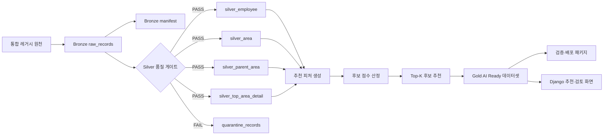
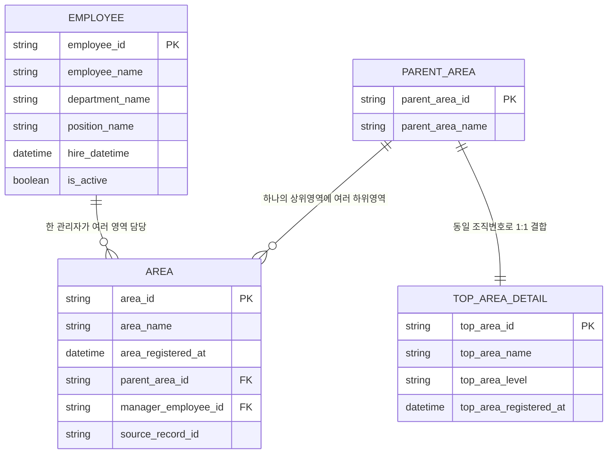

# TO-BE Medallion 데이터 모델

## 1. 범위와 상태

| 계층 | 상태 | 이번 단계 범위 |
|---|---|---|
| Bronze | 확정·구현 완료 | 원본 불변 보존, manifest, 계보, 체크섬 |
| Silver | 확정·구현 완료 | 표준 컬럼·타입·코드, 품질 게이트, 격리 |
| Gold | 확정·구현 완료 | 추천 피처 생성, 후보 점수 산정, Top-K 추천, 서빙 구조 및 화면 구현 |

## 2. 전체 구조

## 3. Bronze 설계

### 3.1 원본 저장 원칙

- 원천 payload를 `raw_json`으로 변경 없이 보존한다.
- 재수집 또는 재실행 시 동일 원본을 덮어쓰지 않는다.
- `source_record_id`, `source_row_no`, SHA-256으로 원본을 추적한다.
- `source_record_sha256`은 원천 문서를 canonical JSON(`sort_keys=true`, `ensure_ascii=false`, `separators=(',', ':')`)으로 직렬화한 UTF-8 바이트를 SHA-256으로 계산한다.
- 수집 성공뿐 아니라 `partial_failure`, `failed`도 manifest에 기록한다.
- Bronze 원본 보존 무결성 목표는 100%다.

### 3.2 `bronze_raw_records`

| 컬럼 | 타입 | 제약/설명 |
|---|---|---|
| `record_id` | string | Bronze 레코드 PK |
| `dataset_id` | string | 데이터셋 식별자 |
| `source_record_id` | string | 원천 레코드 ID, 복원율 대조 키 |
| `source_row_no` | integer | 원천 행 번호 |
| `scheduled_release_at` | datetime | 원천 배포 예정시각 |
| `ingested_at` | datetime | KST 포함 적재시각 |
| `raw_json` | json/string | 원천 payload 불변 보존 |
| `source_record_sha256` | string | 원천 레코드 SHA-256 |
| `run_id` | string | 수집 실행 ID |

### 3.3 manifest

manifest는 `manifest-schema.json`을 정본으로 사용하며 최소한 다음을 기록한다.

`run_id`, `source_name`, `source_uri`, `collected_at`, `ingest_date`, `raw_path`, `content_type`, `file_size_bytes`, `row_count`, `checksum_sha256`, `http_status`, `retry_count`, `crawler_version`, `status`

## 4. Silver 설계

### 4.1 논리 ERD

### 4.2 Silver 테이블

| 테이블 | PK | 주요 FK | 설명 |
|---|---|---|---|
| `silver_employee` | `employee_id` | - | 관리자/직원 표준 정보 |
| `silver_area` | `area_id` | `parent_area_id`, `manager_employee_id` | 업무영역과 담당 관리자 |
| `silver_parent_area` | `parent_area_id` | - | 상위영역 |
| `silver_top_area_detail` | `top_area_id` | - | 최상위영역 상세 |
| `silver_area_join_reference` | 복합키 TBD | 원본 4개 확보 후 확정 | 공식 join-ready 비교용, 현재 조건부 |
| `quarantine_records` | `quarantine_id` | `source_record_id` | 품질 실패 원본과 오류코드 |

### 4.3 관계 규칙

- `silver_area.manager_employee_id` → `silver_employee.employee_id`
- `silver_area.parent_area_id` → `silver_parent_area.parent_area_id`
- `silver_parent_area.parent_area_id` = `silver_top_area_detail.top_area_id`의 1:1 결합은 현재 ERD 가정이며, 실제 코드 체계 검증 후 확정한다.
- FK 미매칭은 승인된 예외가 아니면 Quarantine으로 이동한다.

## 5. 변환 순서

1. `raw_json`을 파싱하되 Bronze 값은 변경하지 않는다.
2. 컬럼명을 `DATA_STANDARD_DICTIONARY.md` 기준으로 변환한다.
3. 코드·공백·유니코드·날짜를 표준화한다.
4. 원천값과 보정 코드를 계보에 기록한다.
5. 필수값·PK·FK·도메인·날짜 품질 게이트를 실행한다.
6. 통과 레코드를 Silver에 적재하고 실패 레코드를 Quarantine에 저장한다.
7. Bronze와 Silver의 고유 `source_record_id`를 대조해 RAW_DB 복원율을 산출한다.
8. Silver 품질 게이트를 통과한 데이터를 기반으로 Gold 추천 피처를 생성한다.
9. 후보별 적합도 점수를 계산하고 Top-K 후보를 선정한다.
10. Gold 결과를 데이터셋과 Django 추천·검토 화면으로 제공한다.

## 6. 품질 게이트

| Gate | 통과 기준 |
|---|---|
| 행 수 대사 | `input = pass + quarantine` |
| RAW_DB 복원율 | 95% 이상 |
| Bronze 보존 | 원본 누락·변조 0건 |
| PK | 중복 0건 |
| 필수값 | 승인되지 않은 누락 0건 |
| FK | 승인되지 않은 고아 0건 |
| 도메인 | 미매핑 코드 0건 |
| 날짜 | 파싱 실패 0건 |
| join-ready 비교 | 공식 비교 데이터 확보 시 불일치 0건 |
| Gold 입력 품질 | Silver 품질 게이트를 통과한 데이터만 사용 |
| 후보 점수 | 동일 입력과 기준시점에서 동일 점수 재현 |
| Top-K 결과 | 점수 내림차순 정렬 및 K명 이내 반환 |
| 데이터 누수 | 기준시점 이후 정보 사용 0건 |

## 7. `REG_DT` 충돌 정책

- 충돌 시 기준 원본은 추후 결정(TBD)이다.
- 결정 전에는 어떤 값도 임의로 선택하거나 덮어쓰지 않는다.
- 원본별 값을 Bronze에 보존하고 Silver에는 `DATE_CONFLICT` 품질 플래그를 남긴다.
- 기준 확정 후 결정 로그, 변경 전후 값, 회귀검증 결과를 함께 기록한다.

## 8. Gold 설계 및 구현

Gold 계층은 Silver 품질 게이트를 통과한 데이터를 이용해 대체인력 후보 추천 결과를 생성한다.

### 8.1 Gold 입력 데이터

Gold 계층은 다음 Silver 테이블을 입력으로 사용한다.

- `silver_employee`
- `silver_area`
- `silver_parent_area`
- `silver_top_area_detail`

품질 게이트를 통과하지 못한 Quarantine 데이터는 Gold 추천 입력으로 사용하지 않는다.

### 8.2 추천 피처

대체인력 후보 평가를 위해 다음 정보를 추천 피처로 활용한다.

- 관리자 근속 정보
- 업무영역 정보
- 부서 정보
- 직위 정보
- 관리자별 담당 업무영역 수
- 퇴직 관리자의 담당 업무영역과 후보 관리자의 업무 연관성
- 후보 관리자의 재직 상태

추천 피처는 실행 기준시점인 `as_of_date`를 기준으로 생성한다.

### 8.3 후보 점수 및 Top-K

1. 퇴직 관리자가 담당하던 업무영역을 확인한다.
2. Silver 데이터에서 추천 대상이 될 수 있는 후보 관리자를 조회한다.
3. 업무영역·부서·직위·근속 등의 추천 피처를 기준으로 후보 점수를 계산한다.
4. 최소점수 기준을 통과하지 못한 후보는 결과에서 제외한다.
5. 후보 점수를 내림차순으로 정렬한다.
6. 상위 K명의 후보를 Top-K 추천 결과로 제공한다.

동일한 데이터, 규칙 및 `as_of_date`로 실행하면 동일한 후보 점수와 순위가 생성되어야 한다.

### 8.4 Gold 데이터셋

Gold 파이프라인은 Silver 데이터를 결합해 AI Ready 데이터셋을 생성한다.

주요 산출물은 다음과 같다.

- Gold 추천 피처 데이터
- 후보별 점수 및 순위 데이터
- Top-K 추천 결과
- `gold_area_dataset.jsonl`
- 오류 레코드 `rejected_records.jsonl`
- `validation_report.json`
- `manifest.json`
- `schema.json`
- 데이터 사전
- 릴리스 노트

검증 오류가 발생하면 오류 레코드를 별도로 분리하고 배포 가능 상태를 실패로 기록한다.

### 8.5 서빙 및 화면

Gold 추천 결과는 Django 추천·검토 화면에서 제공한다.

화면에서는 다음 정보를 확인할 수 있다.

- 퇴직 관리자 정보
- 퇴직 관리자가 담당한 업무영역
- 대체인력 후보 목록
- 후보별 추천 점수
- 후보별 추천 순위
- Top-K 추천 결과
- 후보 선정에 사용된 주요 근거
- 데이터 품질 및 검증 상태

화면은 추천 결과를 최종 인사 결정으로 확정하지 않고, 담당자의 검토를 지원하는 내부 의사결정 보조 도구로 사용한다.

### 8.6 데이터 누수 방지

- 모든 추천 피처와 후보 점수는 `as_of_date`를 기준으로 생성한다.
- 퇴직 이후에 발생한 정보는 학습·평가·추천에 사용하지 않는다.
- 실행 시 사용한 기준시점, 규칙 버전 및 데이터 버전을 manifest와 검증 결과에 기록한다.
- 동일 실행을 재현할 수 있도록 입력 데이터와 Gold 결과의 계보를 보존한다.
