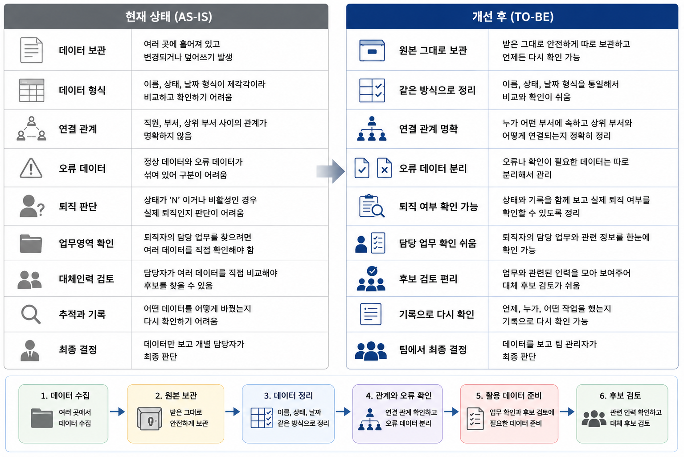

# 업무 요구사항 정의서

## 퇴직 관리자 대체인력 후보 검토 자료

- 문서번호: `BRD-HR-RM-001`
- 버전: `v1.2`
- 팀: `mlo-01-p2-team2`
- 프로젝트 기간: `2026-08-27 ~ 2026-08-28`
- 담당: 자료 정리 담당
- 검토 담당: 인사 업무 담당, 업무 구조 담당, 품질 담당

---

## 1. 배경 및 문제 정의

- 업무 담당 관리자 퇴직 시 담당 업무 인수인계 및 대체인력 검토 필요
- 자료별 이름·상태·날짜 작성 방식 불일치에 따른 현황 파악 및 비교 어려움
- 비활성 상태와 실제 퇴직 상태 간 의미 불명확에 따른 퇴직 여부 판단 한계
- 업무영역과 담당자 간 관계 미정리에 따른 담당 업무 확인 시간 소요
- 퇴직 발생 시 관련 인력 탐색 및 인수인계 검토 반복

---

## 2. 관련 담당자 및 기대 결과

| 담당자 | 기대 결과 |
|---|---|
| 인사 담당자 | 퇴직자 및 대체인력 후보 검토 자료 확보 |
| 팀 관리자 | 퇴직자 담당 업무 및 대체 가능 인력 확인과 최종 판단 |
| 보안 담당자 | 작업 기록과 화면에서 개인정보 마스킹 및 접근 제한 |

---

## 3. 목표 및 확인 방법

| 목표 | 확인 방법 | 완료 기준 |
|---|---|---|
| 처음 받은 자료와 정리 결과 연결 가능성 확보 | 전체 원천 데이터 중 처리 결과를 확인할 수 있는 데이터의 비율 | 95% 이상 |
| 처음 받은 자료 무손상 보관 | 파일 확인값, 행 수, 컬럼 수 비교 | 100% 일치 |
| 자료 작성 기준 통일 및 중대한 오류 제거 | 필수값, 중복, 연결 관계, 상태, 날짜 확인 | 중대한 오류 0건 |
| 작업 과정 재확인 가능성 확보 | 실행 시각, 입력 파일, 처리 건수, 오류 사유 확인 | 필수 기록 누락 0건 |
| 후보 검토 자료 구축 | 업무영역·부서·직위·입사일·재직 여부 조회 | 관련 인력 목록 조회 가능 |

※ 95% 계산 시 분모는 처음 받은 자료의 전체 행 수로 고정한다.

---

## 4. 수행 범위

- 처음 받은 자료의 구성 및 문제점 확인
- 처음 받은 자료의 수정 금지 및 안전 보관
- 이름·부서·직위·업무영역·상태·날짜 작성 방식 통일
- 직원·업무영역·상위 업무영역 간 연결 관계 확인
- 오류 및 추가 확인 자료의 별도 목록 관리
- 별도 목록에 원본 행 번호, 오류 내용, 처리 상태 기록
- 정리 완료 자료의 버전과 처리 시점 기록
- 퇴직 관리자 담당 업무 및 관련 인력 확인 구조 마련
- 자료 설명서·업무 규칙·확인 기준·처리 이력 작성
- 후보 순위 자동 결정
- 운영용 화면 구현

---

## 5. 제외 범위

- 추천 점수 계산
- 대체인력 최종 결정
- 인사발령 자동 처리
- 인공지능 학습
- 운영 서비스 및 실제 인사 시스템 연동

---

## 6. 업무 원칙 및 제약

- 처음 받은 자료의 수정 및 덮어쓰기 금지
- 전체 자료의 95% 이상을 정리 결과 또는 확인 필요 목록과 연결
- `N` 또는 비활성 상태와 실제 퇴직 여부의 동일시 금지
- 퇴직 여부 불명확 자료의 확인 대상 관리
- `REG_DT`가 다른 경우 각 날짜, 자료 출처, 원본 행 번호 개별 보관
- 이름 등 개인정보의 작업 기록 및 발표 자료 직접 노출 제한
- 최종 인사 결정 권한의 팀 관리자 유지

---

## 7. 위험 및 대응

| 위험 | 영향 | 대응 | 상태 |
|---|---|---|---|
| 공식 자료 전체 확인 제한 | 전체 자료 비교 정확도 저하 | 확인 자료 기준 진행 및 추가 자료 수령 후 행 수와 연결 상태 재검증 | open |
| 등록일(`REG_DT`) 기준 미확정 | 동일 대상 날짜 불일치 | 각 날짜와 자료 출처를 보관하고 임의 변경 금지 | open |
| 비활성 상태와 실제 퇴직 상태 불일치 가능성 | 퇴직자 판단 오류 가능성 | 상태 의미 확정 전 퇴직 여부 결정 보류 | open |
| 후보 검토 기준 미확정 | 후보 비교 및 우선순위 결정 제한 | 업무영역·부서·직위·입사일·재직 여부 조회 자료를 우선 준비하고 최종 기준은 팀 합의 후 확정 | open |

---

## 8. 완료 조건

| 완료 조건 | 확인 기준 |
|---|---|
| 처음 받은 자료 재확인 가능 | 전체 행의 95% 이상이 정리 결과 또는 확인 필요 목록과 연결 |
| 처음 받은 자료 보존 | 파일 확인값, 행 수, 컬럼 수의 변경 없음 |
| 처리 결과 확인 가능 | 정상·오류·확인 필요 자료 및 사유 확인 가능 |
| 자료 품질 확보 | 필수값 누락·중복·잘못된 연결·날짜 변환 실패 0건 |
| 작업 과정 확인 가능 | 실행 시각·입력 파일·처리 건수·오류 사유 확인 가능 |
| 후보 검토 자료 조회 가능 | 업무영역·부서·직위·입사일·재직 여부 기준 관련 인력 조회 가능 |
| 자동 결정 제외 | 추천 점수·후보 순위·최종 인사 결정 기능 미포함 |

※ 중대한 오류: 필수값 누락, ID 중복, 잘못된 연결, 날짜 변환 실패, 허용되지 않은 상태값

---

## 9. 작업 필요성

- 관리자 퇴직 시 담당 업무 공백 및 업무 지연 발생 가능성
- 사전 자료 정리를 통한 관련 업무 담당 가능 인력 신속 확인
- 업무영역과 담당자 관계 정리를 통한 인수인계 대상 확인 시간 단축
- 반복적인 자료 탐색 감소 및 업무 대응 기준 통일

---

## 9-1. 해당 작업을 통해 얻을 수 있는 기대효과

### 사용 편의성

- 자료별 이름과 형식의 동일 기준 정리에 따른 비교 편의성 향상
- 정리 결과와 처음 받은 자료 연결에 따른 근거 확인 편의성 향상
- 오류 자료와 정상 자료 분리에 따른 결과 이해 용이성 향상

### 업무상 이점

- 퇴직 이후 인수인계 대상 탐색 시간 단축
- 동일 자료 기준 검토에 따른 담당자별 판단 차이 감소
- 업무 공백 및 중요 업무 누락 가능성 감소
- 반복적인 자료 확인 감소에 따른 인사 담당자 업무 부담 완화

### 기대되는 이익

- 신속한 인수인계에 따른 업무 중단 가능성 감소
- 후보 검토 및 신규 채용 판단에 필요한 시간과 비용 절감 가능성
- 판단 근거 및 처리 이력 확보에 따른 인사 결정 설명과 확인 용이성 향상
- 자료 재사용에 따른 향후 인력 공백 대응력 확보

---

## 9-2. AS-IS / TO-BE

---

## 10. 정량적 기대효과 및 투자 타당성

### 10.1 업무 효율 개선

| 구분 | 기존 | 목표 | 기대효과 |
|---|---:|---:|---:|
| 대체인력 후보 검토시간 | 2시간/건 | 30분/건 | 1.5시간 절감 |
| 월 평균 검토 건수 | 10건 | 10건 | - |
| 월 업무시간 | 20시간 | 5시간 | 15시간 절감 |
| 연간 업무시간 | 240시간 | 60시간 | 180시간 절감 |

### 10.2 비용 절감 효과

담당자 시간당 인건비를 30,000원으로 가정할 경우

| 구분 | 예상 금액 |
|---|---:|
| 기존 연간 업무비용 | 7,200,000원 |
| 개선 후 연간 업무비용 | 1,800,000원 |
| 연간 예상 절감액 | **5,400,000원** |
| 연간 업무비용 절감률 | **75%** |

### 10.3 투자 효과

- 반복적인 후보 탐색 및 데이터 확인 업무비용 절감
- 연간 약 **180시간의 업무시간 확보**
- 연간 약 **540만원의 직접 인건비 절감 효과 예상**
- 표준화된 데이터 재사용을 통한 추가 데이터 정제 비용 감소
- 향후 인력 배치 및 AI 기반 후보 추천으로의 확장 기반 확보

> ※ 상기 금액은 업무시간 및 시간당 인건비를 가정하여 산출한 예시이며,
> 실제 운영 환경의 처리 건수·소요시간·인건비를 기준으로 재산정 필요
