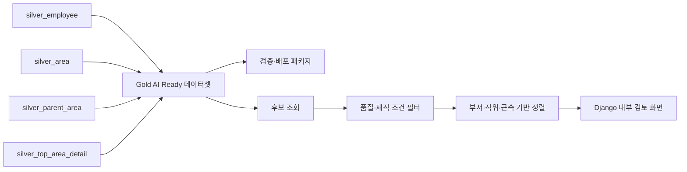

# Gold SQLite ETL 및 규칙 기반 후보 검토 연계

## 목적

Gold SQLite ETL은 Django SQLite에 적재된 Silver 성공 데이터를 읽어 AI Ready 데이터셋과 검증·배포 패키지를 생성한다. Django 내부 검토 화면은 이 데이터와 Silver 관계를 이용해 후보를 조회하고 규칙 기반으로 정렬한다.

숫자 후보 점수, 최소점수, 가중치 및 자동 인사 대상 선정은 제공하지 않는다.

## 입력 계약

| 입력 테이블 | 업무 식별자 | Gold entity |
|---|---|---|
| `silver_employee` | `employee_id` | employee |
| `silver_area` | `area_id` | area |
| `silver_parent_area` | `parent_area_id` | parent_area |
| `silver_top_area_detail` | `top_area_id` | top_area |

`legacy_org_record`는 staging 테이블이므로 기본 Gold 입력에서 제외한다. Gold ETL은 RDB에 이미 분리된 canonical 필드의 타입·코드·enum·datetime과 PK/FK를 최종 검증한다.

## 전체 흐름



## 실행

`validation_pipeline` 디렉터리에서 실행한다.

```powershell
$env:PYTHONPATH = "src;../django/.venv/Lib/site-packages"
python -m gold_pipeline --config gold_config.example.json
```

설정 파일 없이 직접 실행할 수도 있다.

```powershell
python -m gold_pipeline `
  --sqlite ../django/db.sqlite3 `
  --rules rules/silver_canonical.yaml `
  --output output/gold_release `
  --release-version 0.1.0 `
  --run-id gold-20260828-001
```

동일한 SQLite snapshot, output 경로와 `run_id`로 다시 실행하면 파일을 재작성하므로 데이터 행이 누적되지 않는다. 검증 오류가 있으면 `release_ready=false`가 되고 CLI는 종료 코드 `2`를 반환한다.

## Release Package

```text
output/gold_release/
├── data/
│   ├── silver_employee.jsonl
│   ├── silver_area.jsonl
│   ├── silver_parent_area.jsonl
│   ├── silver_top_area_detail.jsonl
│   ├── gold_area_dataset.jsonl
│   └── rejected_records.jsonl
├── source_schema.json
├── schema.json
├── validation_report.json
├── manifest.json
├── data_dictionary.md
├── README.md
└── release_notes.md
```

`gold_area_dataset.jsonl`은 `silver_area`를 중심으로 직원과 상위영역을 결합한 평탄화 AI Ready 데이터셋이다. area와 top_area 사이에 직접 FK가 없으므로 top_area는 별도 entity snapshot으로 보존하며 임의로 조인하지 않는다.

## 검증 단계

1. SQLite 파일과 네 입력 테이블 존재 여부 확인
2. 필수 컬럼·PK와 실제 source schema 확인
3. `correction_codes`와 `_standardization` JSON TEXT 파싱
4. `silver_canonical.yaml` 기반 타입·코드·enum·datetime 검증
5. 필수값과 최종 record key 중복 검증
6. `area.manager_employee_id`, `area.parent_area_id` 참조 무결성 검증
7. Gold AI Ready 데이터셋과 rejected records 생성
8. `validation_report.json`과 manifest 생성

`validation_report.json`에는 입력·승인·제외 건수, 오류 코드, canonical 규칙, 데이터셋별 건수와 `release_ready` 여부를 기록한다.

## 규칙 기반 후보 정렬

Django 서비스는 검토 가능한 후보를 다음 순서로 정렬한다.

1. 대상 관리자와 부서가 같은 후보
2. 대상 관리자와 직위가 같은 후보
3. `as_of_date` 기준 근속기간이 긴 후보
4. 이름
5. 직원 ID

이름과 직원 ID는 동일 조건에서 결과를 재현하기 위한 결정적 동점 처리 기준이다. 이 순서는 숫자 추천점수나 최종 인사 우선순위가 아니다. 후보의 실제 역량·업무량·가용성과 최종 적합성은 담당자가 별도로 검토한다.

현재 구현은 후보 전체를 위 규칙에 따라 정렬해 제공하며 K값으로 결과를 제한하는 Top-K 로직은 포함하지 않는다.

## Django 화면

내부 검토 화면에서는 다음 정보를 확인할 수 있다.

- 검토 대상 관리자와 담당 업무영역
- 규칙 기반으로 정렬된 후보 목록
- 후보별 부서·직위·근속기간과 비교 근거
- 데이터 품질 경고와 보류 사유
- 내부 지속 검토 가능 여부와 다음 행동 안내

화면은 자동 인사결정 결과를 생성하거나 저장하지 않는다.

## 테스트

Gold ETL 테스트:

```powershell
$env:PYTHONPATH = "src;../django/.venv/Lib/site-packages"
python -m unittest tests.test_gold_pipeline -v
```

전체 validation pipeline 테스트:

```powershell
$env:PYTHONPATH = "src"
python -m unittest discover -s tests -v
```

Django 후보 검토 테스트:

```powershell
cd ../django
.\.venv\Scripts\python.exe manage.py test second_project
```

## 완료 기준

- Silver 성공 데이터에서 Gold AI Ready 데이터셋 생성
- canonical 타입·도메인·PK/FK 검증
- 오류 레코드 격리
- 검증 보고서와 manifest 생성
- 동일 입력 재실행 시 결과 재현
- 품질·재직 조건을 적용한 후보 조회
- 부서·직위·근속기간 기반 결정적 정렬
- Django 내부 검토 화면 제공
- 숫자 후보 점수와 자동 인사 대상 선정 미사용
